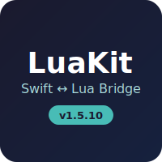

# LuaKit

<div align="center">



[](https://swift.org)
[](https://swift.org)
[](LICENSE)
[](https://github.com/barryw/LuaKit/releases/latest)
[](https://github.com/barryw/LuaKit/actions)
[](https://codecov.io/gh/barryw/LuaKit)

**Seamless Swift-Lua Integration**

[Documentation](Documentation/) • [API Reference](Documentation/API/) • [Examples](Examples/) • [Getting Started](Documentation/Guides/GettingStarted.md)

</div>

## Overview

LuaKit is a Swift framework that provides seamless two-way bridging between Swift and Lua. Write your app logic in Swift and make it scriptable with Lua - no complex bindings required!

### ✨ Key Features

- 🔗 **Automatic Swift-Lua bridging** with the `@LuaBridgeable` macro
- 📦 **Lua 5.4.8 embedded** - no external dependencies
- 🚀 **Type-safe** conversions between Swift and Lua
- 🎯 **Simple API** - get started in minutes
- 🔄 **Two-way communication** - call Lua from Swift and vice versa
- 📱 **Multi-platform** - iOS, macOS, tvOS, and watchOS

## Installation

Add LuaKit to your `Package.swift`:

```swift
dependencies: [
    .package(url: "https://github.com/barryw/LuaKit", from: "1.5.4")
]
```

## Quick Start

```swift
import LuaKit

// 1. Create a Lua state
let lua = try LuaState()

// 2. Execute Lua code
try lua.execute("print('Hello from Lua!')")

// 3. Bridge a Swift class
@LuaBridgeable
class Player: LuaBridgeable {
    var name: String = "Hero"
    var health: Int = 100
    
    func attack() {
        print("\(name) attacks!")
    }
}

// 4. Use from Lua
lua.register(Player.self, as: "Player")
try lua.execute("""
    local p = Player()
    p.name = "Adventurer"
    p:attack()
""")
```

## Documentation

### 📚 Guides
- [Getting Started](Documentation/Guides/GettingStarted.md) - Your first steps with LuaKit
- [Bridging Classes](Documentation/Guides/BridgingClasses.md) - Using @LuaBridgeable
- [Working with Functions](Documentation/Guides/Functions.md) - Function bridging
- [Error Handling](Documentation/Guides/ErrorHandling.md) - Handling errors gracefully

### 🔧 API Reference
- [LuaState](Documentation/API/LuaState.md) - Main Lua runtime interface
- [LuaBridgeable](Documentation/API/LuaBridgeable.md) - Protocol for bridgeable types
- [Macros](Documentation/API/Macros/) - Available Swift macros
- [Full API Reference](Documentation/API/)

### 💡 Examples
- [Quick Start](Examples/QuickStartExample.swift) - Simple introduction
- [Game Scripting](Examples/GameScriptingExample.swift) - Game logic and AI
- [Configuration](Examples/ConfigurationExample.swift) - App configuration
- [Automation](Examples/AutomationExample.swift) - Task automation
- [Data Processing](Examples/DataProcessingExample.swift) - ETL and reporting
- [More Examples](Examples/)

## Use Cases

LuaKit is perfect for:

- 🎮 **Game Development** - Scriptable game logic, modding support
- ⚙️ **Configuration** - Dynamic app configuration without recompiling
- 🤖 **Automation** - User-defined workflows and scripts
- 📊 **Data Processing** - Custom data transformations
- 🧩 **Plugins** - Add plugin support to your app
- 🧪 **Prototyping** - Rapid development and testing

## Requirements

- Swift 5.9+
- iOS 13.0+ / macOS 10.15+ / tvOS 13.0+ / watchOS 6.0+
- Xcode 15.0+

## Contributing

We welcome contributions! Please see our [Contributing Guide](CONTRIBUTING.md) for details.

## Credits

LuaKit embeds Lua 5.4.8. Lua is a powerful, efficient, lightweight, embeddable scripting language. Learn more at [lua.org](https://www.lua.org).

<div align="center">


Made with Lua
</div>

## License

LuaKit is available under the MIT license. See the [LICENSE](LICENSE) file for details.